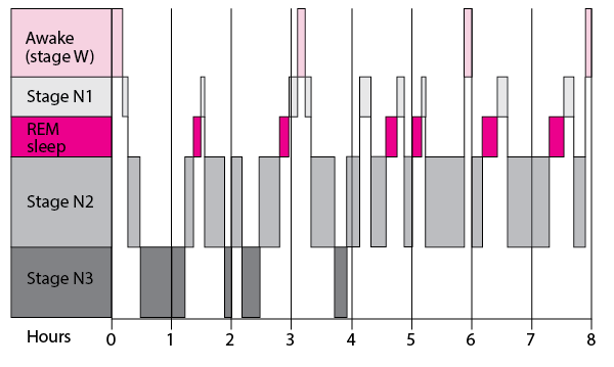
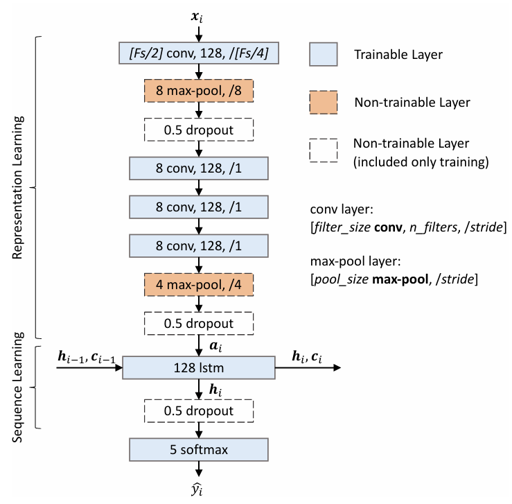
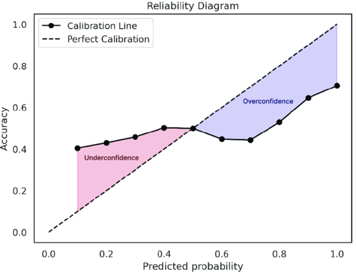
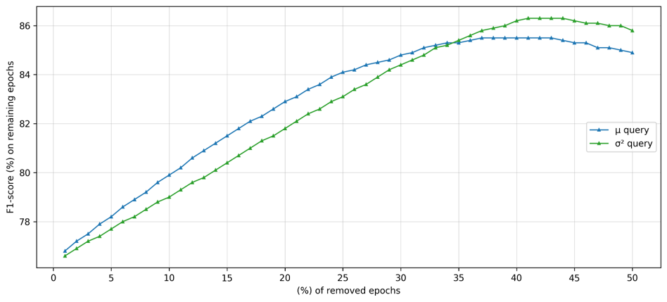
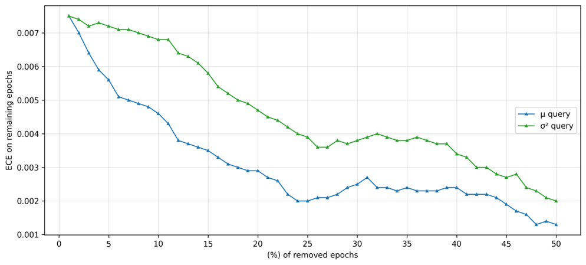
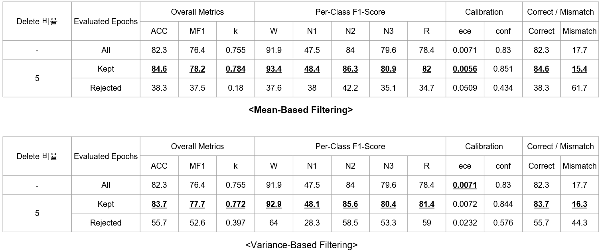

# Sleep Stage Classification using TinySleepNet

This project investigates automatic sleep stage classification using PSG (Polysomnography) signals.

The study is based on **TinySleepNet**, a deep learning model designed for efficient sleep stage classification.  
Beyond baseline classification, this work focuses on **model confidence estimation** and **human-in-the-loop decision support** to improve the reliability of AI-based sleep scoring systems.

---

# Overview

Sleep staging is an essential step in sleep disorder diagnosis.  
Traditionally, sleep stages are manually scored by sleep technicians according to clinical guidelines such as AASM.

However, manual scoring is time-consuming and subject to inter-rater variability.

This project explores the use of deep learning to automatically classify sleep stages from PSG signals and evaluate the reliability of model predictions.

---

# Dataset

The experiments were conducted using **Sleep-EDF**, a publicly available dataset for sleep research.

PSG recordings include EEG signals that are segmented into **30-second epochs** and labeled according to sleep stages.

Sleep stages include:

- Wake (W)
- N1
- N2
- N3
- REM

Example hypnogram:

---

# Model

The model used in this study is **TinySleepNet**, which combines convolutional neural networks and recurrent neural networks.

Key components:

- CNN-based feature extraction from EEG signals
- LSTM-based temporal modeling across sleep epochs
- Sequence-based sleep stage prediction

Model architecture overview:

TinySleepNet was selected due to its strong performance and efficiency in sleep stage classification tasks.

---

# Confidence Estimation

In addition to classification accuracy, this project evaluates **model confidence** using uncertainty estimation techniques.

Monte Carlo Dropout was used to measure prediction variability.

This enables the identification of epochs where the model is uncertain about its prediction.

Calibration performance was evaluated using **Expected Calibration Error (ECE)**.

Example calibration analysis:

---

# Human-in-the-Loop Framework

To improve clinical usability, a **human-in-the-loop framework** was investigated.

The key idea is to automatically detect uncertain predictions and send those epochs for secondary review by clinicians.

Two filtering strategies were analyzed:

- Mean-based confidence filtering
- Variance-based uncertainty filtering

Example uncertainty filtering analysis:

Only a small portion of epochs (e.g., 5%) are selected for secondary review, which can significantly reduce the manual workload while maintaining reliability.

---

# Results

The model achieved strong performance on sleep stage classification.

Evaluation metrics include:

- Accuracy
- Macro F1-score
- Cohen’s Kappa
- Expected Calibration Error (ECE)

Example classification results:

The analysis shows that uncertainty-aware filtering can help improve the reliability of automated sleep scoring systems.

---

# Key Contributions

- Implementation and analysis of **TinySleepNet** for sleep stage classification
- Evaluation of **model confidence using uncertainty estimation**
- Investigation of **human-in-the-loop workflows for clinical AI systems**
